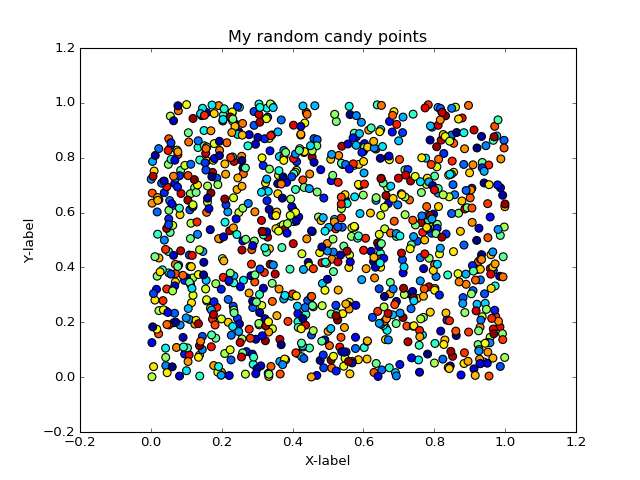

# Exercise-7
Exercise 7: Plotting climate data with Matplotlib and plotly

## Problem 0: Give feedback for the first half of the course(s)

Now as we have reached the first part of our courses, we would kindly ask again for your feedback filling this form.

## Problem 1: Simple scatter plot using random

The aim of this task is to create a simple scatter plot using random numbers and save an image of that plot into your personal 
GitHub repository for this exercise. Write your codes into a `test_plot.py` -script and save it to your personal repository. 
The end result should look something like this:
 
 
 
### Steps:
 - create 1000 random points using numpy's `np.random.rand()` -function that is useful for creating these kind of test plots.
    - create separate numpy arrays for x and y numbers that you will use for plotting the points
 - create a numpy array of 1000 random colors (which is basically an array full of random numbers) so that we get a little bit of sweeter looking plot as a result.
 - create a scatter plot of points (point-size=50) with random colors using `plt.scatter()` -function.
   - you can modify the size of a point using parameter `s` 
   - you can set the colors for the points using parameter `c`
 - add a title and x and y -labels to your plot as shown in the figure above. 
 - save your plot as a .png file into your repository
    
 
## Problem 2: Daily and seasonal average temperatures plot (Matplotlib and plotly - post plot and add link)
**Dave - Make starter script**

- Give students a group of climate data files

## Problem 3: Seasonal averages from different data files (optional)
**Dave**
